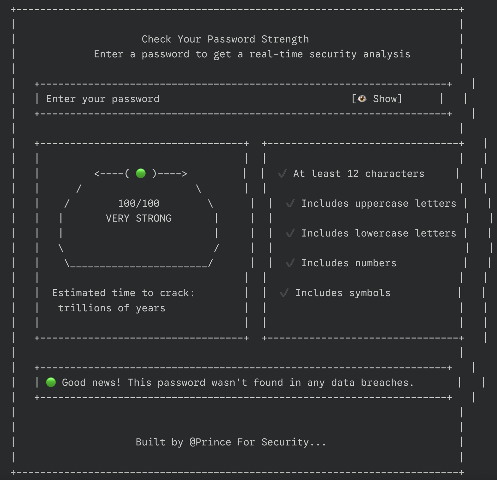

<div align="center">
  
  <h1> 🔒 0xGuard Password Strength Checker </h1>
  <p><em> A Data-Driven System to Evaluate Password Strength with Neon UI Animations and Optional Backend Analytics. </em></p>
  
  <p>
    
    
    
    
  </p>
</div>

## 📌 Project Overview

0xGuard is a modern, interactive password strength checker designed for developers, security enthusiasts, and anyone who cares about online safety. The system provides real-time feedback, visually stunning neon-style animations, and a dynamic strength bar to help users create strong, secure passwords.



## ✨ Key Features

- **County-Level Forecasting**: Predict EV adoption for any Washington State county
- **Interactive Dashboard**: Beautiful Streamlit interface with dark theme
- **3-Year Projections**: Visualize growth trends with historical context
- **Multi-County Comparison**: Analyze regional adoption patterns
- **Machine Learning Model**: RandomForest-based forecasting engine

## 🛠️ Tech Stack

| Component           | Technology                          |
|---------------------|-------------------------------------|
| Core Language       | F Stack Dev.                        |
| Deployment          | Netlify (via Procfile)              |

## 📂 Project Structure
```
0xguard/
├── assets/
│ ├── 0xGuard/Assets/logo.jpg
│ └── 0xGuard/Assets/overview.png
├── Frontend/
│ ├── index.html
│ └── style.css
│ └── script.js
├── LICENSE
└── README.md
```

## 🚀 Deployment Status

[](https://app.netlify.com/projects/0xguard/deploys)

<!-- [](https://ev-demand-forecast.onrender.com) -->

Deployed live on Netlify: [https://0xguard.netlify.app/](https://0xguard.netlify.app/)

## 💻 Local Setup
Follow these instructions to set up the project locally.

```bash
git clone https://github.com/0xPrince121/EV-vehicle-demand-prediction.git
cd EV-vehicle-demand-prediction
install  requirements.
open index.html
```

## 📄 License

This project is licensed under the [MIT License](LICENSE).

## 🙏 Acknowledgements


<br>
<br>
<div align="center"> Made with 💌  by Prince | © 2025 Cybersecurity.
  </div>
